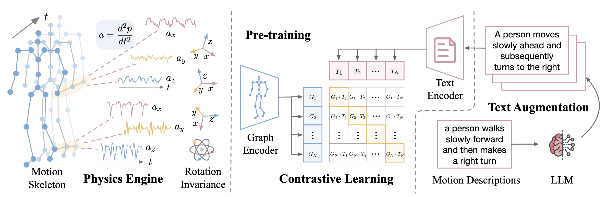
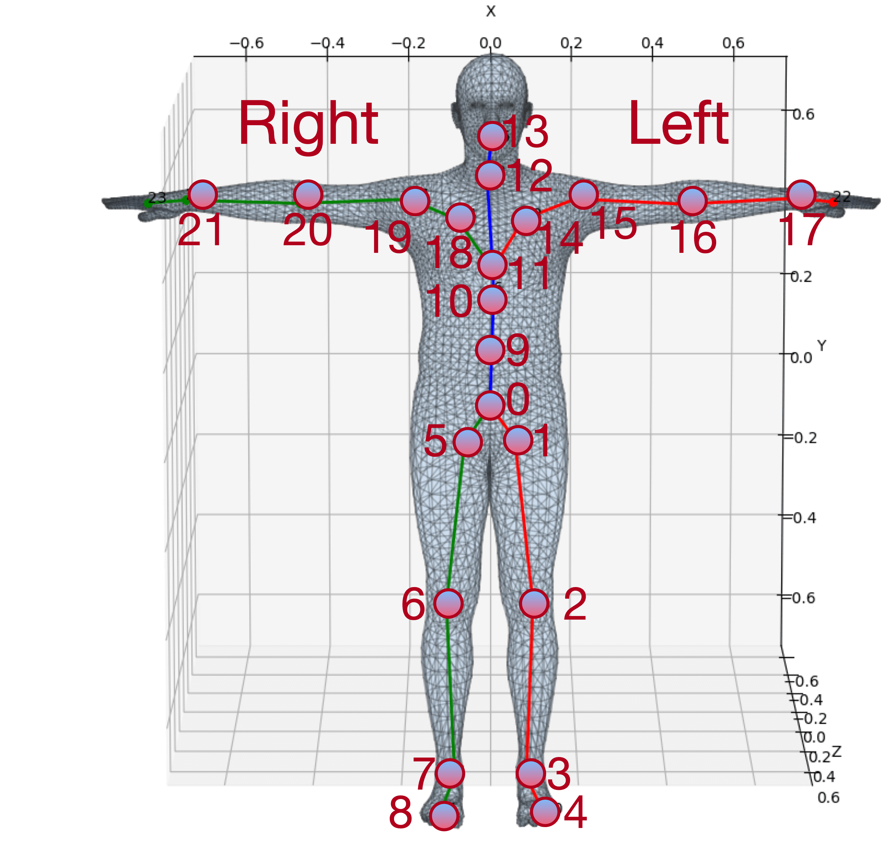

# UniMTS: Unified Pre-training for Motion Time Series

🚀 This is the official implementation of the NeurIPS 2024 paper "UniMTS: Unified Pre-training for Motion Time Series".



UniMTS is the first unified pre-training procedure for motion time series that generalizes across diverse device latent factors (positions and orientations) and activities. Specifically, we employ a contrastive learning framework that aligns motion time series with text descriptions enriched by large language models. This helps the model learn the semantics of time series to generalize across activities. Given the absence of large-scale motion time series data, we derive and synthesize time series from existing motion skeleton data with all-joint coverage. Spatio-temporal graph networks are utilized to capture the relationships across joints for generalization across different device locations. We further design rotation-invariant augmentation to make the model agnostic to changes in device mounting orientations. UniMTS shows exceptional generalizability across 18 motion time series classification benchmark datasets, outperforming the best baselines by 340% in the zero-shot setting, 16.3% in the few-shot setting, and 9.2% in the full-shot setting.

🤗 We have released the model weights at Hugging Face: https://huggingface.co/xiyuanz/UniMTS

### Evaluation

#### Evaluate on 18 Benchmark Datasets

All the evaluation data are publicly available as specified in the paper. We prepare fine-tuning and test real data as npy files of shape (number_of_samples, sequence_length, channel_dimension). We also prepare their label descriptions as a json file. For example, the Opportunity dataset has four activities "stand", "walk", "sit", "lie", and the corresponding json file is as follows. 

Download the processed evaluation data from [Google Drive](https://drive.google.com/file/d/1ybD5Fx6c4ykJiDGLPQlLn0m77z9EkjLb/view?usp=sharing)

```json
{
    "label_dictionary": {
        "0": ["stand"],
        "1": ["walk"],
        "2": ["sit"],
        "3": ["lie"]
    }
}
```

Run the script `evaluate.py` for evaluation.

```sh
python evaluate.py --batch_size 64 
```

Or directly run the bash file

```sh
bash run_evaluation.sh
```

#### Prepare Custom Dataset for Evaluation

* Prepare time series as npy files of shape (number_of_samples, sequence_length, channel_dimension). For channel_dimension, follow the order of (acc_x, acc_y, acc_z, gyro_x, gyro_y, gyro_z).
* Prepare a json file for label descriptions as shown above.
* Normalize time series measurements ($m/s^2$ for acceleration).

run `run_evaluation_custom.sh` as the following example
```sh
python evaluate_custom.py \
--batch_size 64 \
--checkpoint './checkpoint/UniMTS.pth' \
--X_path 'UniMTS_data/TNDA-HAR/X_test.npy' \
--y_path 'UniMTS_data/TNDA-HAR/y_test.npy' \
--config_path 'UniMTS_data/TNDA-HAR/TNDA-HAR.json' \
--joint_list 20 2 21 3 11 \
--original_sampling_rate 50 
```

* `--original_sampling_rate` specifies the original sampling rate of time series (note: we will only the first 10 seconds during evaluation; padding will be automatically applied if the sequence is shorter than 10 seconds).
* `--joint_list` specifies the order of joints for the `channel_dimension`. The joint locations are numbered based on the following figure.

<p align="center">
  
</p>

### Fine-tune

Fine-tune the model with `args.k` samples for each class (k = 1, 2, 3, 5, 10 for few-shot fine-tuning), as well as all the available samples (full-shot fine-tuning). `args.mode` represents the fine-tuning mode, chosen from `full` (fine-tuning both the graph encoder and the linear classifier), `probe` (linear probe, fine-tuning only the linear classifier), and `random` (training from randomly initialized model).

```sh
for k in 1 2 3 5 10
do
python finetune.py --mode full --k $k --batch_size 64 --num_epochs 200 
done

python finetune.py --mode full --batch_size 64 --num_epochs 200 
```

Or directly run the bash file

```sh
bash run_finetune.sh
```

### Pre-training

To prepare pre-training datasets:
1. Download the motion skeletons and paired textual descriptions from [HumanML3D](https://github.com/EricGuo5513/HumanML3D)
2. Convert motion skeletions into BVH files. Run `pos2bvh.py` under the root directory of [inverse kinematics](https://github.com/sigal-raab/Motion)
3. Derive and synthesize motion time series from BVH files. Run `bvh2ts.py` under the root directory of [IMUSim](https://github.com/martinling/imusim)
4. Run `python text_aug.py` to further enrich the HumanML3D text descriptions through large language models.

Run the script `pretrain.py` for pre-training. `args.aug` represents using rotation-invariant augmentation (set to 1) or not (set to 0) during pre-training. 

```sh
python pretrain.py --aug 1 --batch_size 64 
```

Or directly run the bash file

```sh
bash run_pretrain.sh
```

### Citation

If you find our work helpful, please cite the following paper